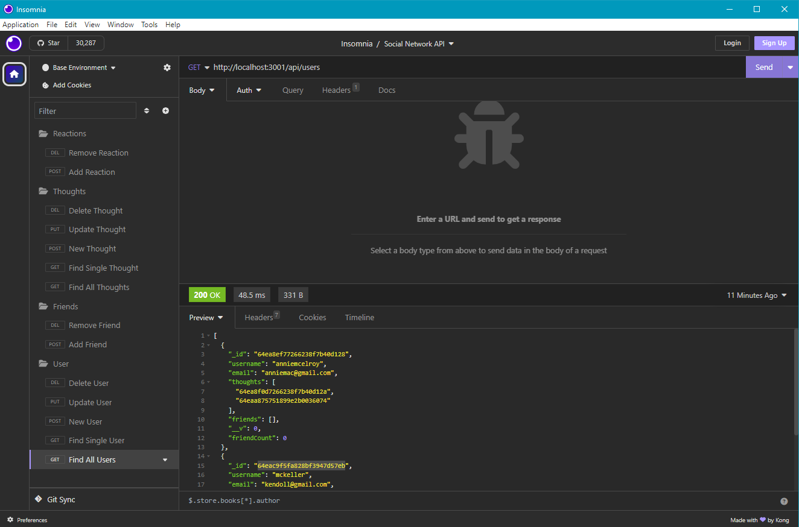

# Social Network API

## Description

This is a backend application of a social network api. Using a NoSQL database, MongoDB, along with it's counterpart mongoose with express.js to generate an API for a social network web application. It allows users to share their thoughts, react to other's thoughts, and even create a friends list. Moment.js is also used to format the dates created.

## Table of Contents
  - [Installation](#installation)
  - [Usage](#usage)
  - [License](#license)
  - [Questions](#questions)

## Installation

Git clone the repository.

Once downloaded please make sure to download all necessary npm packages by opening integrated terminal and typing in:

`npm i`

This will download Moment, Express, Mongoose, and Dotenv.

## Usage

To run the backend application you must first make sure to create your own 'env' file to connect to your MongoDB database correctly. Afterwards you may run the server by running the command:

`node server.js`

From there, you may run all the routes. Please know that there is no seed data so you'll have to create your own data within Insomnia.

Here is how you may setup insomnia to test all routes:

[Recording of Application](https://drive.google.com/file/d/1piJKUNe8JpRqTLu0RHcKlKuIAxQEBI2S/view)

## License

This project is licensed under MIT. Please check LICENSE document in repository for more information.

## Questions

If you have any questions, feel free to reach me at [GitHub](https://github.com/Annie-McElroy) or via email at [annie.mcelroy8522@gmail.com](annie.mcelroy8522@gmail.com).

